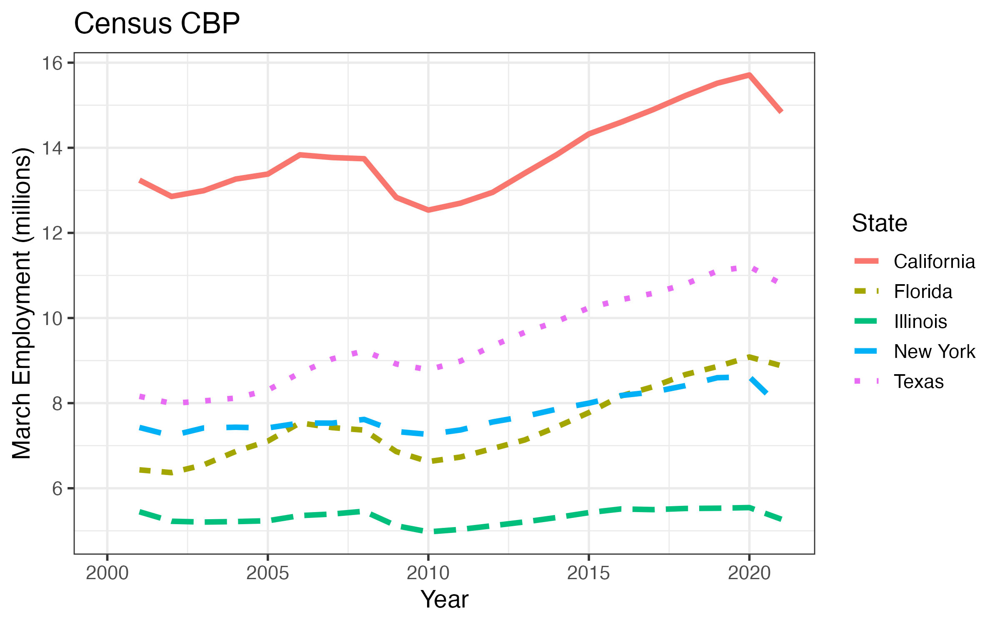

CensusCBP: prepared CBP data sets
================
Created by Bradley Setzler, University of Chicago

[Prepared Census CBP data sets are located
here.](https://github.com/setzler/EconData/tree/master/DataRepo/CensusCBP/)

### Download and clean the Census CBP

Census County Business Patterns (CBP) data is managed by the `getCBP()`
function. The arguments are:

  - `years`: years of CBP data to download (integer vector). Supported
    year range is 2001 to 2017.
  - `location`: Can be `"county"`, `"state"`, or `"national"`
    (character).
  - `industry`: Number of digits used in the NAICS code. `0` indicates
    use all industries.
  - `LFO`: Choose a legal form of organization (LFO). Options include
    `'C'` for C-corporations, `'S'` for S-corporations, `'P'` for
    partnerships. Default is `'-'`, which means to use all LFO types.

The resulting data set includes the variables `year, employment_march,
payroll_quarter1, establishments` as well as fips codes and industry
codes corresponding to the `aggregation` choice.

### Demonstration

Here, we download and clean the CBP files during 2001 - 2017. They are
saved to the `DataRepo/CensusCBP` directory as `CBP_state_total.csv`.

``` r
library(EconData)
CBP <- getCBP(years = 2001:2017, location = "state", industry = 0) 
write.csv(CBP,file="~/github/EconData/DataRepo/CensusCBP/CBP_state_total.csv", row.names=F)
```

Let’s plot the resulting data for the 5 most populous
states:

``` r
CBP <- setDT(read.csv(file="~/github/EconData/DataRepo/CensusCBP/CBP_state_total.csv"))
kable(CBP[1:5])
```

| state\_fips | state\_name | year | employment\_march | establishments | payroll\_quarter1 |
| ----------: | :---------- | ---: | ----------------: | -------------: | ----------------: |
|           1 | Alabama     | 2001 |           1620952 |          99261 |       10962678000 |
|           1 | Alabama     | 2002 |           1581117 |          99931 |       11054027000 |
|           1 | Alabama     | 2003 |           1597529 |          99838 |       11453340000 |
|           1 | Alabama     | 2004 |           1629141 |         100802 |       11846970000 |
|           1 | Alabama     | 2005 |           1667526 |         101976 |       12605884000 |

``` r
gg <- ggplot(aes(x=year,y=employment_march/1e6,color=state_name,linetype=state_name),data=CBP[state_name %in% c('California','Florida','Illinois','New York','Texas')]) + 
  geom_line(size = 1.5) +
  theme_bw(base_size=14) + 
  labs(x="Year", y="March Employment (millions)",title="Census CBP",color="State",linetype="State") +
  scale_x_continuous(breaks= pretty_breaks()) +
  scale_y_continuous(breaks= pretty_breaks())
ggsave(gg,file='CBP_state_employment.png',width=8,height=5)
```


