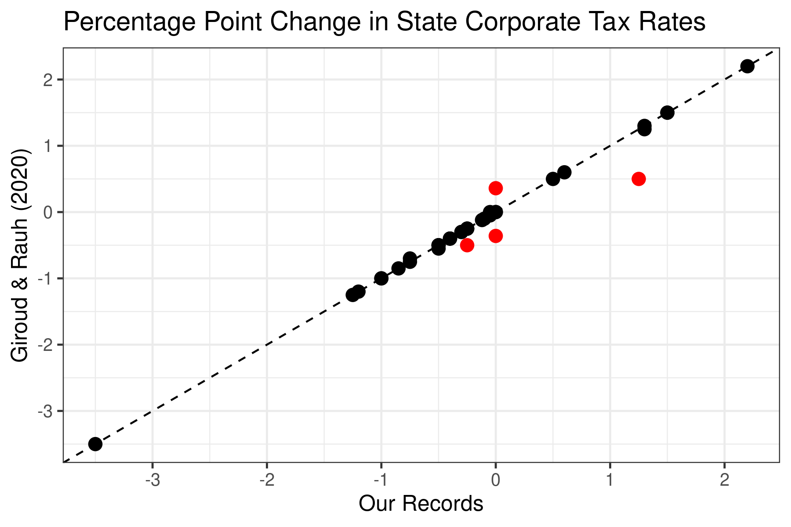

```{r setup, include=FALSE}
knitr::opts_chunk$set(echo = TRUE)
```


```{r echo=F, eval=T, warning=FALSE, comment=FALSE, warning=FALSE}
library(data.table)
library(ggplot2)
library(scales)
library(knitr)
```


[Prepared corporate tax rate data sets are located here.](https://github.com/setzler/EconData/tree/master/DataRepo/StateCorpTax/)


### Download and clean state corporate tax rates

The function `getStateCorpTax()` downloads the corporate tax rates from the Tax Foundation, then manually perfects the values based on footnotes and secondary documents from the Tax Foundation.

```{r echo=T, eval=F, warning=FALSE, comment=FALSE, warning=FALSE}
library(EconData)
CIT <- getStateCorpTax()
write.csv(CIT,file="StateCorpTax.csv", row.names=F)

```

The function `getCorpTax()` does the following:

- **Our rates:** repeats `getStateCorpTax()` above,
- **Giroud-Rauh:** downloads the 1976-2012 tax rates from Giroud & Rauh (2020), extracts and converts them from Stata .dta to .csv, saving to GiroudRauh_1976_2012.csv.
- **Tax Foundation, Current File:** downloads and saves the 2002-2020 Tax Foundation current file on corporate tax rates. This is the main file used by `getStateCorpTax()`.
- **Tax Foundation, Legacy File:** downloads and saves the 2000-2014 Tax Foundation legacy file on corporate tax rates. This file is used for data corrections by `getStateCorpTax()`.

```{r echo=T, eval=F, warning=FALSE, comment=FALSE, warning=FALSE}

getCorpTax(output_path = "~/github/EconData/DataRepo/StateCorpTax/")

```

Here are the resulting corporate tax rates for Illinois during 2000-2020:

```{r echo=T, eval=T, warning=FALSE, comment=FALSE, warning=FALSE}

CIT <- setDT(read.csv(file="StateCorpTax.csv"))
kable(CIT[state=='Illinois'])


```


### Comparison to Giroud & Rauh (2020) data set for 2000-2012

Let's compare the corrected corporate tax rates to those of Giroud & Rauh (2020, JPE) during the overlapping years 2000-2012. Both data sets agree that the tax rate did not change in 93% of observations, so we focus on the state-year observations with changes.

**Note:** We drop the four states that Giroud & Rauh flag throughout this comparison, which are Michigan, Ohio, Texas, and Washington.


```{r echo=T, eval=T, warning=FALSE}

## load Giroud-Rauh data
GR <- setDT(read.csv(file="GiroudRauh_1976_2012.csv"))
setnames(GR,'cit','cit_GR')
flag_states <- GR[cit_flag!=0,unique(state)]
GR <- GR[!(state %in% flag_states)] # drop Michigan, Ohio, Texas, and Washington

## merge GR data with my data
dd <- setDT(read.csv(file="StateCorpTax.csv"))
dd <- merge(dd,GR,by=c('state','year'))
dd <- merge(dd, dd[,list(state,year=year+1,cit_lag = cit,cit_GR_lag = cit_GR)],by=c('state','year'))
dd[, cit_diff := cit - cit_lag]
dd[, cit_GR_diff := cit_GR - cit_GR_lag]
change_share <- dd[,mean((cit_diff != 0) | (cit_GR_diff != 0))]
dd <- dd[((cit_diff != 0) | (cit_GR_diff != 0)),list(state,year,cit_diff,cit_GR_diff)]
sprintf("The tax rate changed in %s (%s percent) of state-year observations.",nrow(dd),round(change_share*100,1))

## find those that are substantially different
similar <- dd[(abs(cit_diff - cit_GR_diff) < .1)]
different <- dd[!(abs(cit_diff - cit_GR_diff) < .1)]

## plot comparison of year-over-year tax changes
gg <- ggplot() +
  geom_point(aes(x=cit_diff,y=cit_GR_diff), data=similar, color="black", size=3) +
  geom_point(aes(x=cit_diff,y=cit_GR_diff), data=different, color="red", size=3) +
  theme_bw(base_size=12) + 
  labs(x="Our Records", y="Giroud & Rauh (2020)",title="Percentage Point Change in State Corporate Tax Rates") +
  geom_abline(intercept = 0, slope = 1, linetype='dashed') +
  scale_x_continuous(breaks= pretty_breaks()) +
  scale_y_continuous(breaks= pretty_breaks())
ggsave(gg,file='GR_tax_change_comparison.png',width=6,height=4)

```



Out of 37 changes in the tax rate reported by at least one of the data sets during 2000-2012, the corrected data and the Giroud & Rauh data match in all but 4 cases.  The minor discrepancy in Indiana in 2012 appears to be due to how the mid-year phase-in of the tax change is handled. However, the Tax Foundation records do not mention their temporary 0.36% increase in the tax rate in New Jersey or why their 2000 tax rate in New Hampshire was 0.75% higher.

```{r echo=T, eval=T, warning=FALSE}

setnames(different,c("State","Year","Ours","Giroud & Rauh"))
kable(different[])

```

