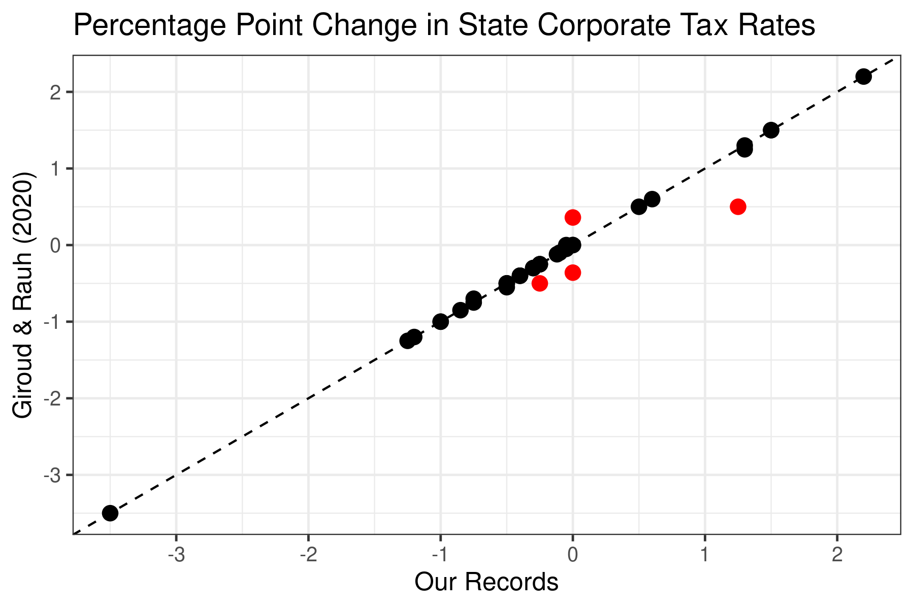

StateCorpTax: State Corporate Tax Rates, 2000-2020
================
Created by Bradley Setzler, University of Chicago

[Prepared corporate tax rate data sets are located
here.](https://github.com/setzler/EconData/tree/master/DataRepo/StateCorpTax/)

### Download and clean state corporate tax rates

The function `getStateCorpTax()` downloads the corporate tax rates from
the Tax Foundation, then manually perfects the values based on footnotes
and secondary documents from the Tax Foundation.

``` r
library(EconData)
CIT <- getStateCorpTax()
write.csv(CIT,file="StateCorpTax.csv", row.names=F)
```

The function `getCorpTax()` does the following:

  - **Our rates:** repeats `getStateCorpTax()` above,
  - **Giroud-Rauh:** downloads the 1976-2012 tax rates from Giroud &
    Rauh (2020), extracts and converts them from Stata .dta to .csv,
    saving to GiroudRauh\_1976\_2012.csv.
  - **Tax Foundation, Current File:** downloads and saves the 2002-2020
    Tax Foundation current file on corporate tax rates. This is the main
    file used by `getStateCorpTax()`.
  - **Tax Foundation, Legacy File:** downloads and saves the 2000-2014
    Tax Foundation legacy file on corporate tax rates. This file is used
    for data corrections by `getStateCorpTax()`.

<!-- end list -->

``` r
getCorpTax(output_path = "~/github/EconData/DataRepo/StateCorpTax/")
```

Here are the resulting corporate tax rates for Illinois during
2000-2020:

``` r
CIT <- setDT(read.csv(file="StateCorpTax.csv"))
kable(CIT[state=='Illinois'])
```

| state    |  cit | year |
| :------- | ---: | ---: |
| Illinois | 7.30 | 2000 |
| Illinois | 7.30 | 2001 |
| Illinois | 7.30 | 2002 |
| Illinois | 7.30 | 2003 |
| Illinois | 7.30 | 2004 |
| Illinois | 7.30 | 2005 |
| Illinois | 7.30 | 2006 |
| Illinois | 7.30 | 2007 |
| Illinois | 7.30 | 2008 |
| Illinois | 7.30 | 2009 |
| Illinois | 7.30 | 2010 |
| Illinois | 9.50 | 2011 |
| Illinois | 9.50 | 2012 |
| Illinois | 9.50 | 2013 |
| Illinois | 9.50 | 2014 |
| Illinois | 7.75 | 2015 |
| Illinois | 7.75 | 2016 |
| Illinois | 7.75 | 2017 |
| Illinois | 9.50 | 2018 |
| Illinois | 9.50 | 2019 |
| Illinois | 9.50 | 2020 |

### Comparison to Giroud & Rauh (2020) data set for 2000-2012

Let’s compare the corrected corporate tax rates to those of Giroud &
Rauh (2020, JPE) during the overlapping years 2000-2012. Both data sets
agree that the tax rate did not change in 93% of observations, so we
focus on the state-year observations with changes.

**Note:** We drop the four states that Giroud & Rauh flag throughout
this comparison, which are Michigan, Ohio, Texas, and Washington.

``` r
## load Giroud-Rauh data
GR <- setDT(read.csv(file="GiroudRauh_1976_2012.csv"))
setnames(GR,'cit','cit_GR')
flag_states <- GR[cit_flag!=0,unique(state)]
GR <- GR[!(state %in% flag_states)] # drop Michigan, Ohio, Texas, and Washington

## merge GR data with my data
dd <- setDT(read.csv(file="StateCorpTax.csv"))
dd <- merge(dd,GR,by=c('state','year'))
dd <- merge(dd, dd[,list(state,year=year+1,cit_lag = cit,cit_GR_lag = cit_GR)],by=c('state','year'))
dd[, cit_diff := cit - cit_lag]
dd[, cit_GR_diff := cit_GR - cit_GR_lag]
change_share <- dd[,mean((cit_diff != 0) | (cit_GR_diff != 0))]
dd <- dd[((cit_diff != 0) | (cit_GR_diff != 0)),list(state,year,cit_diff,cit_GR_diff)]
sprintf("The tax rate changed in %s (%s percent) of state-year observations.",nrow(dd),round(change_share*100,1))
```

    ## [1] "The tax rate changed in 37 (6.6 percent) of state-year observations."

``` r
## find those that are substantially different
similar <- dd[(abs(cit_diff - cit_GR_diff) < .1)]
different <- dd[!(abs(cit_diff - cit_GR_diff) < .1)]

## plot comparison of year-over-year tax changes
gg <- ggplot() +
  geom_point(aes(x=cit_diff,y=cit_GR_diff), data=similar, color="black", size=3) +
  geom_point(aes(x=cit_diff,y=cit_GR_diff), data=different, color="red", size=3) +
  theme_bw(base_size=12) + 
  labs(x="Our Records", y="Giroud & Rauh (2020)",title="Percentage Point Change in State Corporate Tax Rates") +
  geom_abline(intercept = 0, slope = 1, linetype='dashed') +
  scale_x_continuous(breaks= pretty_breaks()) +
  scale_y_continuous(breaks= pretty_breaks())
ggsave(gg,file='GR_tax_change_comparison.png',width=6,height=4)
```



Out of 37 changes in the tax rate reported by at least one of the data
sets during 2000-2012, the corrected data and the Giroud & Rauh data
match in all but 4 cases. The minor discrepancy in Indiana in 2012
appears to be due to how the mid-year phase-in of the tax change is
handled. However, the Tax Foundation records do not mention their
temporary 0.36% increase in the tax rate in New Jersey or why their 2000
tax rate in New Hampshire was 0.75% higher.

``` r
setnames(different,c("State","Year","Ours","Giroud & Rauh"))
kable(different[])
```

| State         | Year |   Ours | Giroud & Rauh |
| :------------ | ---: | -----: | ------------: |
| Indiana       | 2012 | \-0.25 |        \-0.50 |
| New Hampshire | 2001 |   1.25 |          0.50 |
| New Jersey    | 2006 |   0.00 |          0.36 |
| New Jersey    | 2010 |   0.00 |        \-0.36 |
