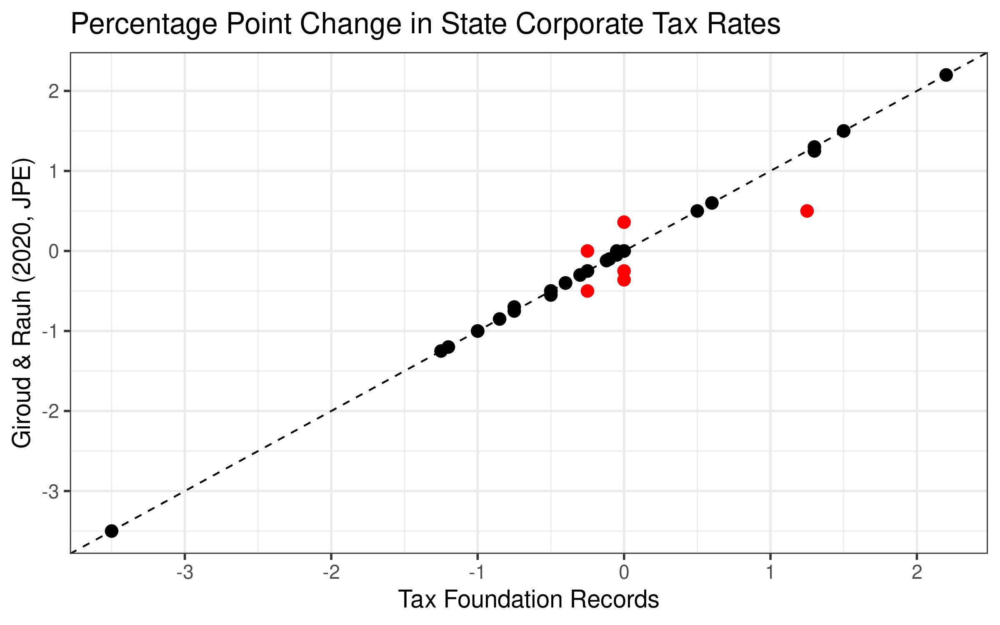
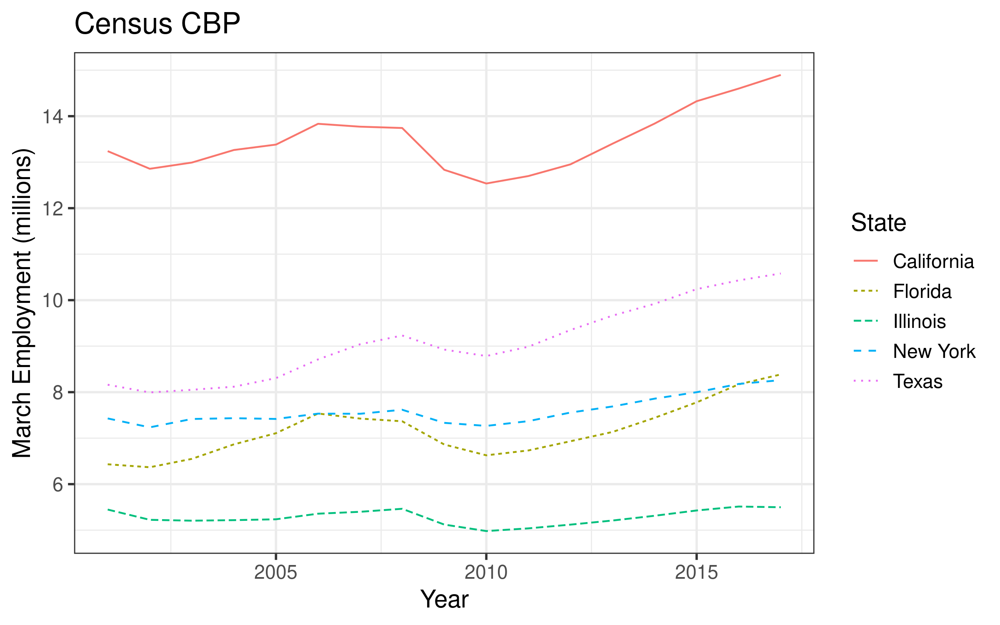

```{r setup, include=FALSE}
knitr::opts_chunk$set(echo = TRUE)
```


This is a directory for managing publicly-available economics data. It contains two components:

- [EconData](https://github.com/setzler/EconData/tree/master/EconData): R package to automatically download and prepare various publicly-available economic data sets from source.
- [DataRepo](https://github.com/setzler/EconData/tree/master/DataRepo) A repository of prepared data sets that were created by the EconData package.

To use the R package, run the following:

```{r echo=T, eval=F}
devtools::install_github("setzler/EconData/EconData")
```
```{r echo=T, eval=T}
library(EconData)
```


```{r echo=F, eval=T, warning=FALSE, comment=FALSE, warning=FALSE}
library(data.table)
library(ggplot2)
library(scales)
library(knitr)
```


The included data sets are listed below.

# 1. State Corporate Tax Rates

[Prepared corporate tax rate data sets are located here.](https://github.com/setzler/EconData/tree/master/DataRepo/StateCorpTax/)


### Download and clean state corporate tax rates

The function `getCorrectedCorpTax()` downloads the corporate tax rates from the Tax Foundation, then manually perfects the values based on footnotes and secondary documents from the Tax Foundation.

```{r echo=T, eval=T, warning=FALSE, comment=FALSE, warning=FALSE}
CIT <- getCorrectedCorpTax()
write.csv(CIT,file="~/github/EconData/DataRepo/StateCorpTax/Corrected_2000_2015.csv", row.names=F)
kable(CIT[state=='Illinois'])

```

The function `getCorpTax()` does the following:

- **Corrected rates:** repeats `getCorrectedCorpTax()` above,
- **Giroud-Rauh:** downloads, extracts, converts from XLSX to CSV, and exports the 1976-2012 tax rates from Giroud & Rauh (2020, JPE).
- **Tax Foundation, Current File:** downloads and saves the 2002-2020 Tax Foundation current file on corporate tax rates. This is the main file used by `getCorrectedCorpTax()`.
- **Tax Foundation, Legacy File:** downloads and saves the 2000-2014 Tax Foundation legacy file on corporate tax rates. This file is used for data corrections by `getCorrectedCorpTax()`.

```{r echo=T, eval=T, warning=FALSE, comment=FALSE, warning=FALSE}

getCorpTax(output_path = "~/github/EconData/DataRepo/StateCorpTax/")

```


### Demonstration

Let's compare the corrected corporate tax rates to those of Giroud & Rauh (2020, JPE) during the overlapping years 2000-2012. Both data sets agree that the tax rate did not change in 93% of observations, so we focus on the remaining  7.1% of state-year observations below.

**Note:** We drop the four states that Giroud & Rauh flag throughout this comparison, which are Michigan, Ohio, Texas, and Washington.


```{r echo=T, eval=T, warning=FALSE}

## load Giroud-Rauh data
GR <- setDT(read.csv(file="~/github/EconData/DataRepo/StateCorpTax/GiroudRauh_1976_2012.csv"))
setnames(GR,'cit','cit_GR')
flag_states <- GR[cit_flag!=0,unique(state)]
GR <- GR[!(state %in% flag_states)] # drop Michigan, Ohio, Texas, and Washington

## merge GR data with my data
dd <- setDT(read.csv(file="~/github/EconData/DataRepo/StateCorpTax/Corrected_2000_2015.csv"))
dd <- merge(dd,GR,by=c('state','year'))
dd <- merge(dd, dd[,list(state,year=year+1,cit_lag = cit,cit_GR_lag = cit_GR)],by=c('state','year'))
dd[, cit_diff := cit - cit_lag]
dd[, cit_GR_diff := cit_GR - cit_GR_lag]
change_share <- dd[,mean((cit_diff != 0) | (cit_GR_diff != 0))]
sprintf("We find that the tax rate changes in %s percent of state-year observations.",round(change_share*100,1))

## find those that are substantially different
dd <- dd[((cit_diff != 0) | (cit_GR_diff != 0)),list(state,year,cit_diff,cit_GR_diff)]
similar <- dd[(abs(cit_diff - cit_GR_diff) < .1)]
different <- dd[!(abs(cit_diff - cit_GR_diff) < .1)]

## plot comparison of year-over-year tax changes
gg <- ggplot() +
  geom_point(aes(x=cit_diff,y=cit_GR_diff), data=similar, color="black", size=3) +
  geom_point(aes(x=cit_diff,y=cit_GR_diff), data=different, color="red", size=3) +
  theme_bw(base_size=14) + 
  labs(x="Tax Foundation Records", y="Giroud & Rauh (2020, JPE)",title="Percentage Point Change in State Corporate Tax Rates") +
  geom_abline(intercept = 0, slope = 1, linetype='dashed') +
  scale_x_continuous(breaks= pretty_breaks()) +
  scale_y_continuous(breaks= pretty_breaks())
ggsave(gg,file='EconData/inst/CorpTax/GR_tax_change_comparison.png',width=8,height=5)

setnames(different,c("State","Year","Corrected","Giroud & Rauh"))
kable(different[])

```



Out of 37 changes in the tax rate reported by at least one of the data sets during 2000-2012, the corrected data and the Giroud & Rauh data match in all but 4 cases.  The minor discrepancy in Indiana in 2012 appears to be due to how the mid-year phase-in of the tax change is handled. However, the Tax Foundation records do not mention their temporary 0.36% increase in the tax rate in Indiana or why their 2000 tax rate in New Hampshire was 0.75% higher.


# 2. Census CBP

[Prepared Census CBP data sets are located here.](https://github.com/setzler/EconData/tree/master/DataRepo/CensusCBP/)


### Download and clean the Census CBP


Census County Business Patterns (CBP) data is managed by the `getCBP()` function. The arguments are:

- `years`: years of CBP data to download (integer vector). Supported year range is 2001 to 2017.
- `location`: Can be `"county"`, `"state"`, or `"national"` (character).
- `industry`: Number of digits used in the NAICS code. `0` indicates use all industries.
- `LFO`: Choose a legal form of organization (LFO). Options include `'C'` for C-corporations, `'S'` for S-corporations, `'P'` for partnerships. Default is `'-'`, which means to use all LFO types.

The resulting data set includes the variables `year, employment_march, payroll_quarter1, establishments` as well as fips codes and industry codes corresponding to the `aggregation` choice.


### Demonstration

Here, we download and clean the CBP files during 2001 - 2017. They are saved to the `DataRepo/CensusCBP` directory as `CBP_state_total.csv`.

```{r echo=T, eval=T}

CBP <- getCBP(years = 2001:2017, location = "state", industry = 0) 
write.csv(CBP,file="~/github/EconData/DataRepo/CensusCBP/CBP_state_total.csv", row.names=F)
kable(CBP[])

```


Let's plot the resulting data for the 5 most populous states:

```{r echo=T, eval=T}

CBP <- setDT(read.csv(file="~/github/EconData/DataRepo/CensusCBP/CBP_state_total.csv"))
CBP[, state := '']
CBP[state_fips==6, state := 'California']
CBP[state_fips==12, state := 'Florida']
CBP[state_fips==17, state := 'Illinois']
CBP[state_fips==36, state := 'New York']
CBP[state_fips==48, state := 'Texas']

gg <- ggplot(aes(x=year,y=employment_march/1e6,color=state,linetype=state),data=CBP[state != '']) + 
  geom_line() +
  theme_bw(base_size=14) + 
  labs(x="Year", y="March Employment (millions)",title="Census CBP",color="State",linetype="State") +
  scale_x_continuous(breaks= pretty_breaks()) +
  scale_y_continuous(breaks= pretty_breaks())
ggsave(gg,file='EconData/inst/CensusCBP/CBP_state_employment.png',width=8,height=5)


```




